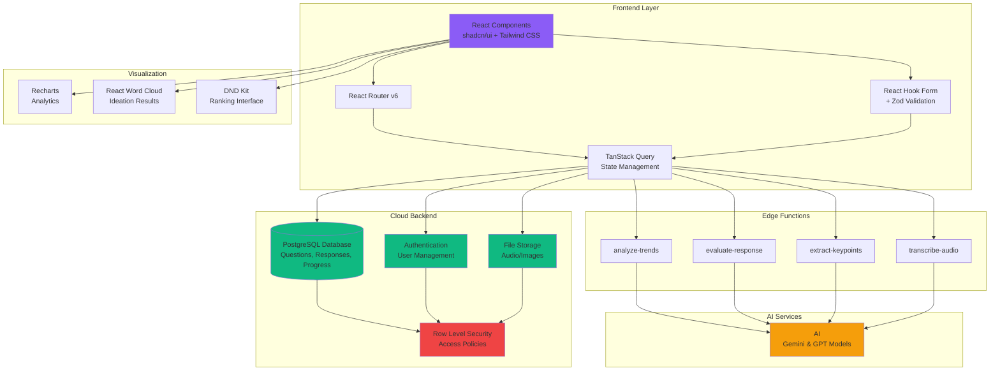

# vibeVote 🎮

A gamified employee feedback platform that transforms organizational feedback into an engaging experience through game mechanics, AI-powered insights, and competitive elements.

[](https://reactjs.org/)
[](https://www.typescriptlang.org/)
[](https://tailwindcss.com/)

## 🌟 Overview

vibeVote revolutionizes how organizations collect and analyze employee feedback by gamifying the entire experience. Users engage with daily questions, earn XP, level up, and compete on leaderboards—all while providing valuable insights to their organization.

## ✨ Key Features

### 🎯 Gamification System

- **XP & Leveling**: Earn experience points for each response, with progressive leveling that unlocks rewards
- **Daily Streaks**: Maintain consecutive days of participation with visual streak tracking
- **Leaderboards**: Compete with peers through relative rankings and global standings
- **Level Rewards**: Unlock achievements, badges, and perks as you progress
- **Horse Race Animation**: Dynamic visual feedback celebrating engagement

### 💬 Multi-Format Questions

- **Multiple Choice**: Quick polls with vote distribution visualization
- **Open-Ended**: Free-form text responses with AI-powered sentiment analysis
- **Ranking**: Drag-and-drop prioritization with animated result comparisons
- **Yes/No**: Binary questions for quick pulse checks
- **Ideation**: Creative brainstorming with word cloud visualizations

### 🤖 AI-Powered Insights

- **Response Evaluation**: Automated assessment of open-ended answers
- **Sentiment Analysis**: Understanding emotional context in feedback
- **Trend Detection**: Identifying patterns across responses
- **Keyword Extraction**: Highlighting key themes from feedback
- **Audio Transcription**: Voice-to-text for spoken responses

### 📊 Analytics & Visualization

- **Question Analytics**: Track participation rates, response patterns, and engagement
- **Word Clouds**: Visual representation of collective thoughts
- **Vote Distribution**: Real-time polling results with animated charts
- **Ranking Results**: Comparative analysis of priority preferences
- **Trend Reports**: Historical data and pattern identification

### 🎁 Rewards & Achievements

- Progressive reward system tied to user levels
- Unlockable features and capabilities
- Achievement badges and milestones
- Visual celebration of accomplishments

### 🎨 User Experience

- **Play Mode**: Immersive full-screen question experience
- **List View**: Browse and filter available questions
- **Undo Functionality**: Revise recent responses within time limits
- **Search & Filter**: Find questions by category or type
- **Responsive Design**: Seamless mobile and desktop experiences
- **Dark Mode**: Comfortable viewing in any lighting condition

### 👥 Social Features

- Propose new questions to the organization
- View relative positioning on leaderboards
- Track personal progress and statistics
- Profile customization and history

## 🏗️ Architecture



## 🛠️ Technology Stack

### Frontend

- **React 18** - Modern UI library with hooks
- **TypeScript** - Type-safe development
- **Vite** - Fast build tool and dev server
- **Tailwind CSS** - Utility-first styling
- **shadcn/ui** - Customizable component library
- **TanStack Query** - Server state management
- **React Router v6** - Client-side routing
- **React Hook Form** - Form handling
- **Zod** - Schema validation
- **Recharts** - Data visualization
- **React Word Cloud** - Word cloud generation
- **DND Kit** - Drag-and-drop functionality

### Backend (Cloud)

- **Supabase** - PostgreSQL database
- **Row Level Security** - Data access policies
- **Edge Functions** - Serverless compute
- **Real-time Subscriptions** - Live data updates
- **Authentication** - User management

### AI Integration

- Sentiment analysis and evaluation
- Trend detection and insights
- Audio transcription services

## 📁 Project Structure

```
vibeVote/
├── src/
│   ├── components/          # Reusable UI components
│   │   ├── ui/             # shadcn/ui primitives
│   │   ├── AppSidebar.tsx  # Main navigation
│   │   ├── BottomNav.tsx   # Mobile navigation
│   │   └── ...             # Feature components
│   ├── pages/              # Route components
│   │   ├── Homepage.tsx    # Main dashboard
│   │   ├── QuestionDetail.tsx
│   │   ├── Analytics.tsx
│   │   ├── Profile.tsx
│   │   ├── Rewards.tsx
│   │   └── Trees.tsx
│   ├── lib/                # Utility functions
│   │   ├── xpSystem.ts     # XP & leveling logic
│   │   └── utils.ts        # Helper functions
│   ├── hooks/              # Custom React hooks
│   ├── integrations/       # External services
│   │   └── supabase/       # Database client
│   └── assets/             # Static files
├── supabase/
│   ├── functions/          # Edge functions
│   │   ├── analyze-trends/
│   │   ├── evaluate-response/
│   │   ├── extract-keypoints/
│   │   └── transcribe-audio/
│   └── migrations/         # Database schema
└── public/                 # Public assets
```

## 🚀 Getting Started

### Prerequisites

- Node.js 18+ and npm
- Git

### Installation

1. **Clone the repository**

   ```bash
   git clone git@github.com:bila9630/vibeVote.git
   cd vibeVote
   ```

2. **Install dependencies**

   ```bash
   npm install
   ```

3. **Environment Setup**

   Environment variables are pre-configured in `.env`:
   - `VITE_SUPABASE_URL`
   - `VITE_SUPABASE_PUBLISHABLE_KEY`
   - `VITE_SUPABASE_PROJECT_ID`

4. **Start development server**

   ```bash
   npm run dev
   ```

5. **Open your browser**

   Navigate to `http://localhost:5173`

### Available Scripts

```bash
npm run dev          # Start development server
npm run build        # Build for production
npm run preview      # Preview production build
npm run lint         # Run ESLint
```

## 📊 Database Schema

### Core Tables

- **questions** - Question content and metadata
- **responses** - User answers and engagement
- **user_progress** - XP, levels, and achievements
- **leaderboard** - Ranking and competition data
- **proposed_questions** - Community suggestions

### Edge Functions

- **analyze-trends** - Pattern detection across responses
- **evaluate-response** - AI-powered answer assessment
- **extract-keypoints** - Theme identification
- **transcribe-audio** - Voice response processing

## 🎨 Design System

The project uses a comprehensive design system built on:

- Semantic color tokens defined in `index.css`
- Customized shadcn/ui components
- Responsive breakpoints for mobile/desktop
- Dark mode support throughout
- Consistent spacing and typography scales

## 📱 Responsive Design

- **Desktop**: Full sidebar navigation, expanded analytics
- **Mobile**: Bottom navigation bar, optimized layouts
- **Tablet**: Adaptive interface with smart breakpoints

## 🔐 Security

- Row Level Security (RLS) policies on all tables
- Authenticated API routes
- Secure edge function execution
- Environment variable protection

## 📝 License

This project was created by the Hackstreetboys and follows standard web application licensing.

## 💡 Use Cases

- **Employee Engagement**: Transform surveys into interactive experiences
- **Organizational Feedback**: Collect insights in a non-intrusive way
- **Team Building**: Foster healthy competition through leaderboards
- **Continuous Improvement**: Track sentiment and trends over time
- **Innovation**: Crowdsource ideas through ideation questions

## 🙏 Acknowledgments

Built with ❤️ using:

- [Lovable](https://lovable.dev) - AI-powered development platform
- [Supabase](https://supabase.com) - Backend infrastructure
- [shadcn/ui](https://ui.shadcn.com) - Component library
- [Tailwind CSS](https://tailwindcss.com) - Styling framework

---

**Ready to transform your feedback process?** Get started with vibeVote today! 🚀
